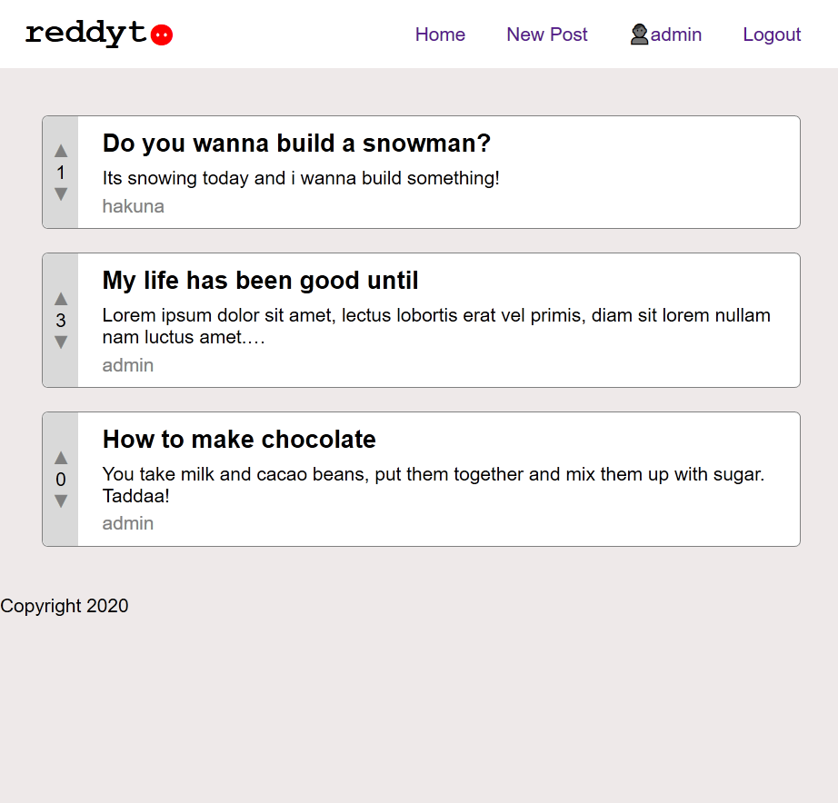

# reddyt

reddyt is a small reddit clone written with Django and Django REST Framework.

Improvements I'm aware of that could be made if it goes into production:

- use PostgreSQL database
- improve UI and UX, e.g. require a confirmation button to delete the user, implement color scheme
- implement communities (`r/fishing`, `r/pilot`), like real reddit
- make the backend API only and implement a Frontend Framework like React for dynamic pages and reuseable components
- limit new post and comments to one per 30seconds
- implement email confirmation
