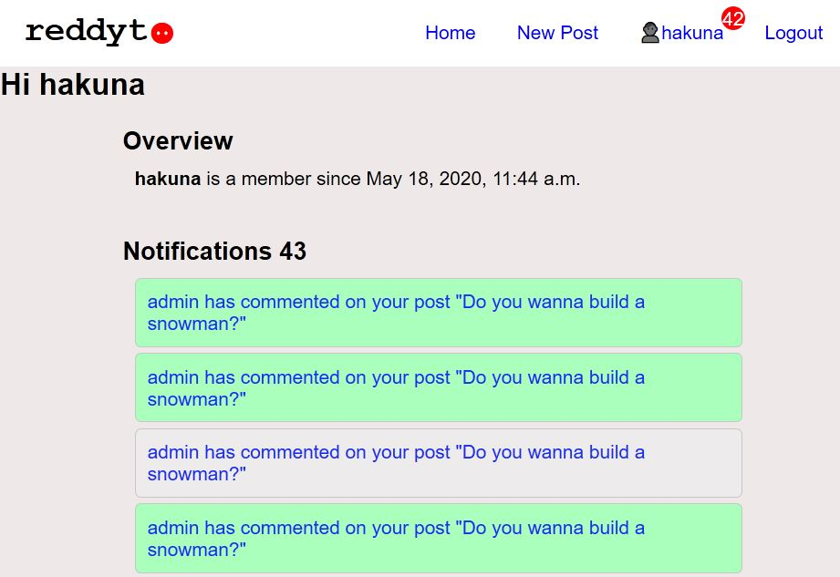
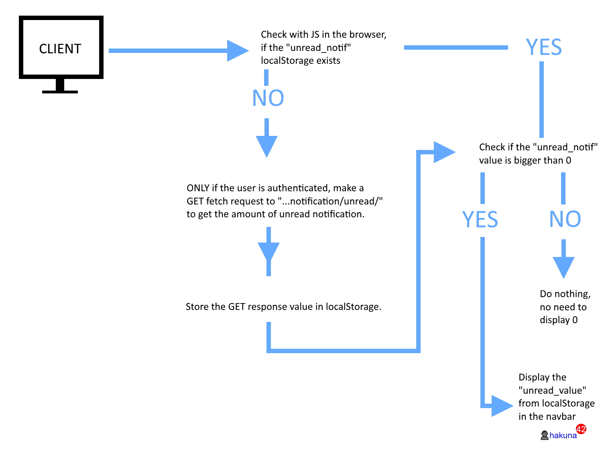
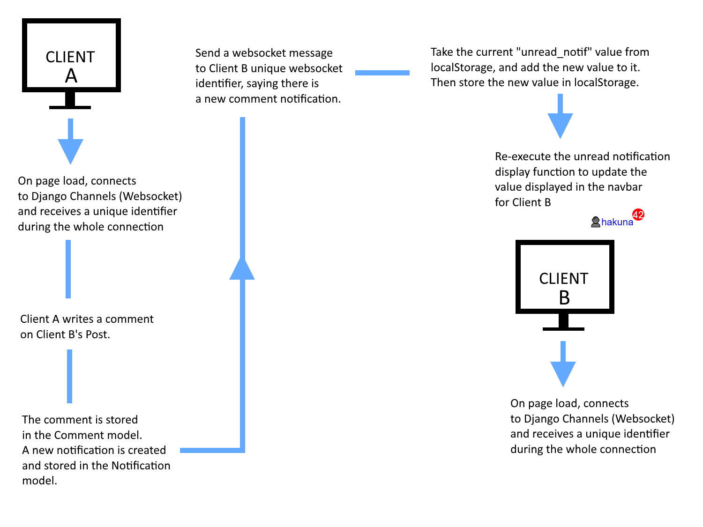

# Explanation of the notification_app

### Purpose:

The purpose of the `notification_app` is to:

- store notifications and display them to the recipient
- serve the amount of all unread notification in the recipients navbar
  Currently, a notification is only created whenever User A comments on User B posts.

All notifications are viewable inside the users profile page.

The count of all unread notifications should be displayed to the user in the navbar.

### Implementation:

Whenever User A comments on User B post, a new notification is created and
stored in the database.
The Notification model has these fields:

- recipient -> The user to display the notifications to
- sender -> The user who created the notification
- post -> The post a comment has been made to
- read -> Has the notification message been read by the recipient
- created_timestamp

Two approaches, Django REST API and Channels (websockets), have been implemented to make display notifications as dynamic as possible.

#### REST API Workflow

First of all, we want to display, in the navbar to the recipeint, all unread notifications whenever they re-/load the page.
For this, the user has of course to be authenticated.

#### Channels (Websockets) Workflow

For the case when a user is active on a page and did not reload the it, we want to push new notifications to them. For this case, Django Channels (websockets) are used, so that we can update the notification counter in the navbar.

## Additional explanation:

The file `notification_app/consumer.py` is a file used by Django Channels and decides the methods to execute whenever a user connects, disconnects to Django Channels and sends a message to Django Channels.

A new notification websocket message is pushed to the user inside `notification_app/models.py`. Using Django `post_save` signal, whenever a new notification is created, the `send_websocket_notification` sends a websocket message to the client having the unique recipient identifier (in this case called `user_room` which is
a string made of "user-RECIPIENT_ID".
The `async_to_sync` method requires a `type` value. This value is the method used to send the websocket message. In our case, we use the `send_message` method
which can be found inside `notification_app/consumer.py`. This method simply sends a message to the recipient user, with whatever value was passed through
`async_to_sync` (in our case we passed `"notification": f"New {instance.get_notification_type_display()}"`).

New notifications are created inside the `discussion_app/views.py` file in the `comment_form` method.

---

The file `notification_app/routing.py` is a file used by Django Channels to defined which path notifications should be served on the websocket.
This file is similar to an `urls.py` file.
This file is included inside the ROOT channels router file, `reddyt_project/routing.py`.

---

The files `notification_app/api_urls.py` and `notification_app/api_views.py` are only used to serve the amount of unread notification to an authenticated user.
These files are linked up with the `api_app`, so that requests are made within the `www.localhost:8000/api/v1/` endpoint.
